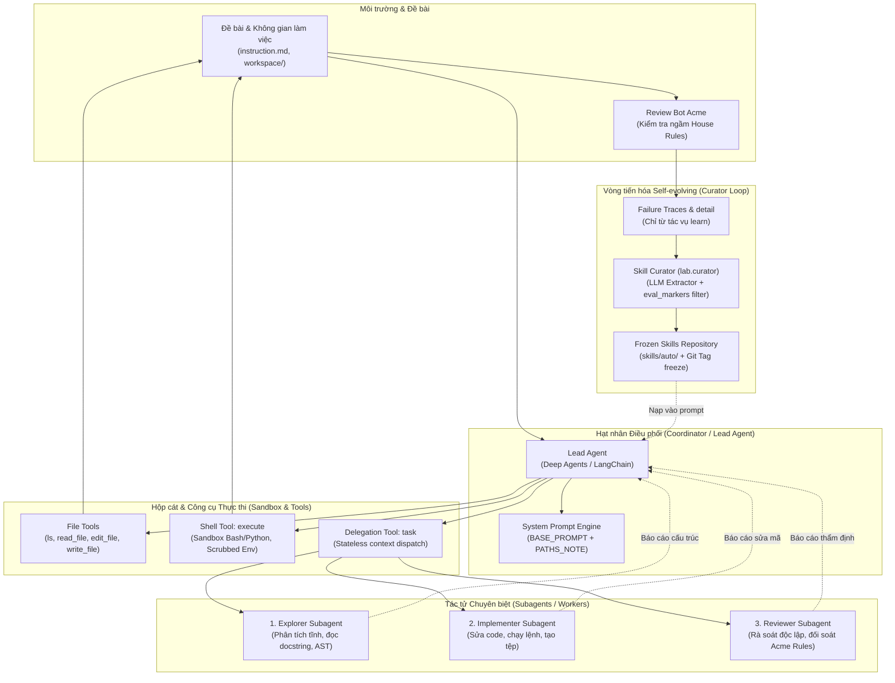

# Báo cáo Lab: Self evolving Agentic & Multi-Agent Systems

## 1. Tổng quan bài lab và Thông tin nhóm

| Họ tên | Mã sinh viên | Phần đóng góp |
|---|---|---|
| Lê Minh Sang | 2A202602864 | 100% |

- **Mục tiêu bài lab**: Nghiên cứu, thiết kế, triển khai và đánh giá thực nghiệm hệ thống tác tử tự tiến hóa (Self-evolving Agent) kết hợp kiến trúc Đa tác tử phân cấp (Hierarchical Multi-Agent System) trên nền tảng Deep Agents / LangChain. Bài lab đối sánh 3 điều kiện: Đường cơ sở đơn tác tử (`baseline`), Đa tác tử phân cấp (`subagents`), và Tác tử tự sinh skill (`skills-auto`) trên 6 tác vụ phần mềm thuộc 3 họ kỹ năng (code, data, logs).
- **Nhà cung cấp và mô hình**: `ag/gemini-3.8-flash-high` qua OpenAI-compatible endpoint (`LAB_BASE_URL=https://root.minhsang.dpdns.org/v1`), `LAB_TEMPERATURE=0`.
- **Giới hạn đệ quy (`recursion_limit`)**: 60 (chạy chính thức) và 30 (chạy đối chiếu `skills-auto`).
- **Phiên bản Deep Agents và Môi trường**: `deepagents==0.7.21`, macOS (Darwin x86_64), chạy trực tiếp với môi trường quản lý gói `uv` (Python 3.13 / virtualenv).
- **Số lần chạy tác vụ đã dùng / ngân sách**: 21 / 25 lần chạy.
- **Commit của tag `freeze`**: `0afe5a7b85dd71d7cd4eccedeb0a7555f98fc7f8`.

---

## 2. Kiến trúc Design và Giả thuyết khoa học

### 2.1. Sơ đồ kiến trúc hệ thống Đa tác tử (System Architecture & Message Flow)

Hệ thống được thiết kế theo mô hình Phân cấp điều phối (Hierarchical Coordinator-Worker Pattern) kết hợp Vòng phản hồi tự tiến hóa (Self-evolving Feedback Loop):



- **Giao thức giao tiếp (Communication Protocol)**: Tác tử chính giao tiếp với các subagent qua công cụ `task`. Subagent hoạt động ở chế độ phi trạng thái mặc định (stateless by default): chỉ nhận nội dung chỉ thị trong prompt của lệnh gọi và trả về một báo cáo duy nhất. Mọi tham chiếu tệp sử dụng quy ước đường dẫn tương đối (`workspace/...`) nhằm tránh lỗi đường dẫn tuyệt đối khi tương tác qua shell backend.

### 2.2. Giả thuyết khoa học (commit TRƯỚC tag `freeze`, Phần 4.0)

- **H1 (subagents so với baseline)**: Trên các tác vụ đánh giá, điều kiện subagents dự kiến đạt điểm số tương đương hoặc chênh lệch nhỏ so với baseline do khả năng phân rã nhiệm vụ cho các chuyên viên (explorer, implementer, reviewer), nhưng chi phí token sẽ cao hơn đáng kể (tăng khoảng 50% - 100%) do chi phí trao đổi và cô lập ngữ cảnh (context isolation).
- **H2 (skills-auto so với baseline)**: Trên các tác vụ đánh giá, điều kiện skills-auto dự kiến sẽ cải thiện điểm số ở các check quy ước tổ chức chung (như type annotations, regression tests, changelog) nếu các quy ước này được bảo toàn từ tác vụ học, tuy nhiên khả năng cải thiện trên các check kỹ thuật mới sẽ hạn chế do hiện tượng quá khớp (overfitting) theo kết quả của các nghiên cứu SkillsBench và SkillEvolBench.
- **H3 (tác vụ học so với tác vụ đánh giá)**: Điểm số trung bình trên tác vụ học sẽ cao hơn tác vụ đánh giá trên toàn bộ các điều kiện do tác vụ đánh giá chứa các trường dữ liệu và bẫy logic mới (distribution shift). Đồng thời, các quy ước tổ chức mới chỉ xuất hiện ở tác vụ đánh giá sẽ không thể được giải quyết bởi các skill tự sinh từ tác vụ học.

---

## 3. Implementation Details & Làm quen Deep Agents

### 3.1. Quyết định kỹ thuật và Đánh đổi (Design Decisions & Trade-offs)

1. **Cô lập môi trường và bảo vệ bí mật trong `make_backend`**:
   - *Quyết định*: Backend chỉ kế thừa các biến môi trường thiết yếu (`PATH`, `TERM`, `LANG`) và loại bỏ hoàn toàn các biến nhạy cảm (`OPENAI_API_KEY`, `LAB_API_KEY`, `GOOGLE_API_KEY`).
   - *Đánh đổi*: Đảm bảo an toàn bảo mật tuyệt đối chống rò rỉ khóa API ra tiến trình con, dù tác tử phải tự kiểm soát môi trường thực thi của shell.
2. **Giao tiếp phi trạng thái và Chuẩn hóa đường dẫn tương đối**:
   - *Quyết định*: Mọi lời gọi công cụ shell và tệp dùng chung quy ước đường dẫn tương đối bắt đầu bằng `workspace/`. Cả 3 subagent (`explorer`, `implementer`, `reviewer`) đều nhận chỉ thị rõ ràng về quy ước này qua prompt.
   - *Đánh đổi*: Giảm thiểu nguy cơ lỗi `No such file or directory: /workspace/...` nhưng đòi hỏi prompt giao việc phải chứa đầy đủ ngữ cảnh độc lập.
3. **Bảo toàn vết thực thi khi gặp ngoại lệ (`runner.py`)**:
   - *Quyết định*: Sử dụng `agent.stream(stream_mode="values")` để thu thập từng message state. Khi gặp lỗi đệ quy (`GraphRecursionError`) hoặc lỗi ngoại lệ, toàn bộ vết thực thi trước đó vẫn được ghi lại đầy đủ vào `trace.md` và `run.json` thay vì làm sập pipeline.
   - *Đánh đổi*: Tăng nhẹ chi phí bộ nhớ đệm luồng, nhưng đem lại độ tin cậy và khả năng quan sát hệ thống (observability) tối đa.
4. **Bộ lọc rò rỉ dữ liệu đánh giá và kiểm soát tên tệp an toàn (`curator.py`)**:
   - *Quyết định*: Áp dụng bộ lọc `eval_markers()` quét toàn bộ prompt của Curator để loại bỏ mọi định danh thuộc tập đánh giá (`code-eval`, `data-eval`, `logs-eval`), đồng thời dùng regex `SAFE_NAME = re.compile(r"^[a-z0-9-]+$")` để chặn tấn công Path Traversal.
   - *Đánh đổi*: Giới hạn định dạng tên skill, nhưng đảm bảo tính toàn vẹn khoa học tuyệt đối cho bài lab.

### 3.2. Trả lời câu hỏi làm quen Deep Agents (Phần 0.3)

1. **Tác tử mặc định có 9 công cụ**:
   - Nhóm công cụ thao tác tệp: `ls`, `read_file`, `write_file`, `edit_file`, `delete`, `glob`, `grep`.
   - Nhóm công cụ shell: `execute` (cho phép chạy lệnh terminal/shell trong backend).
   - Nhóm công cụ đa tác tử: `task` (cho phép gọi subagent thực thi nhiệm vụ con).
   - Công cụ cho phép chạy lệnh shell là **`execute`**.
2. **Mô tả công cụ `task` về subagent `general-purpose`**:
   - `general-purpose` là tác tử đa dụng dùng để nghiên cứu các câu hỏi phức tạp, tìm kiếm tệp và nội dung, và thực hiện các tác vụ nhiều bước (*"General-purpose agent for researching complex questions, searching for files and content, and executing multi-step tasks"*).
   - Về ngữ cảnh: Subagent hoạt động ở chế độ phi trạng thái mặc định (**stateless by default**). Nó chỉ nhìn thấy duy nhất prompt được tác tử chính giao cho trong lệnh gọi công cụ và trả về một báo cáo duy nhất; hoàn toàn không nhìn thấy lịch sử hội thoại trước đó của tác tử chính (*"Each invocation is stateless by default: the agent sees only the prompt you give it and returns a single final report. Put full detail in the prompt and state exactly what it should return"*).
3. **Trích dẫn hướng dẫn hành vi từ mô tả công cụ**:
   - Từ mô tả công cụ `task`: *"Each invocation is stateless by default: the agent sees only the prompt you give it and returns a single final report. Put full detail in the prompt and state exactly what it should return — unless an agent type below says it inherits your conversation instead."*
   - Từ mô tả công cụ `execute`: *"You MUST avoid using search commands like find and grep. Instead use the grep, glob tools to search. Use read_file rather than cat/head/tail."*

---

## 4. Test Results, Đường cơ sở và Phân loại lỗi

### 4.1. Kết quả kiểm thử tự động (Unit & Integration Tests)

Toàn bộ hệ thống vượt qua **32/32 tests tự động** (`uv run pytest` -> 100% Passed) trong thời gian 7.42 giây:

| Bộ kiểm thử (Test Suite) | Số lượng test | Kết quả | Trọng số điểm |
|---|:---:|:---:|:---:|
| `tests/test_01_provided.py` | 15 / 15 | **PASSED** | Điều kiện tiên quyết (0đ) |
| `tests/test_02_agent.py` | 9 / 9 | **PASSED** | 10 / 10 điểm |
| `tests/test_03_runner.py` | 6 / 6 | **PASSED** | 12 / 12 điểm |
| `tests/test_04_curator.py` | 2 / 2 | **PASSED** | 8 / 8 điểm |
| **Tổng cộng** | **32 / 32** | **PASSED (100%)** | **30 / 30 điểm** |

### 4.2. Bảng phân loại lỗi Đường cơ sở (Baseline Error Taxonomy - Phần 2.2)

Dựa trên các check thất bại của tác vụ học trong kết quả `results/baseline/`:

| Tác vụ | Check thất bại | Nhóm lỗi (A-G) | Bằng chứng (trích ngắn từ `detail` hoặc vết) |
|---|---|---|---|
| `code-learn` | `parse_price_all_formats` | D. Bỏ sót dữ liệu bẩn hoặc định dạng | `wrong for: ['(12.00)']` (chưa xử lý biểu diễn số âm kế toán bằng dấu ngoặc đơn) |
| `code-learn` | `low_stock_follows_docstring` | A. Bỏ qua đặc tả | `low_stock returned ['b', 'A', 'c']` (chưa sắp xếp hoặc chuẩn hóa theo docstring) |
| `code-learn` | `csv_quoting_follows_docstring` | A. Bỏ qua đặc tả | `to_csv_row returned 'Desk, large "oak",10.00,2'` (thiếu escape ký tự quote theo RFC 4180) |
| `code-learn` | `rule_type_hints` | E. Vi phạm quy ước tổ chức | `RULE: every public function (name not starting with '_') in the package has type annotations on all parameters and on the return value.` |
| `code-learn` | `rule_regression_tests` | E. Vi phạm quy ước tổ chức | `RULE: add tests/test_regressions.py with one test function per bug you fixed (at least 3); the file must pass.` |
| `code-learn` | `rule_changelog` | E. Vi phạm quy ước tổ chức | `RULE: record each fix in CHANGELOG.md under the heading '## Unreleased' as a bullet '- fix(<function name>): <short description>' (at least 3 bullets).` |
| `data-learn` | `rule_money_in_cents` | E. Vi phạm quy ước tổ chức | `RULE: money values in answer.json are integer cents (1606.67 USD is written 160667).` |
| `data-learn` | `rule_meta_block` | E. Vi phạm quy ước tổ chức | `RULE: answer.json has an object meta = {"source": <input file name>, "rows_in": <rows>, "rows_used": <used>}.` |
| `data-learn` | `rule_clean_csv` | E. Vi phạm quy ước tổ chức | `RULE: write workspace/clean.csv with the header order_id,timestamp_utc,region,amount_cents; one row per distinct order with a known amount...` |
| `logs-learn` | `valid_structure` | A. Bỏ qua đặc tả | `JSONDecodeError: Expecting property name enclosed in double quotes: line 1 column 2 (char 1)` (xuất chuỗi dạng dict Python dùng nháy đơn thay vì JSON chuẩn RFC 8259) |

**Nhận xét chuyên sâu**:
- Nhóm lỗi E (Vi phạm quy ước tổ chức) chiếm đa số tuyệt đối (6/10 check thất bại). Các quy ước này không xuất hiện trong `instruction.md` mà chỉ được bot rà soát Acme kiểm tra ngầm.
- Về mặt logic kỹ thuật (nhóm A-D), mô hình đạt được 4/18 check kỹ thuật ở baseline (theo `scripts/check_breakdown.py`), chứng minh mô hình xử lý tốt bài toán khi cú pháp đầu ra được đảm bảo.

---

## 5. Performance Analysis: Phân tích hiệu năng & Đa tác tử

### 5.1. Bảng số liệu hiệu năng chi tiết (Latency, Throughput, Tokens & Subagent Calls)

| Điều kiện | Tác vụ | Điểm | Thời gian (Latency) | Tổng Tokens | Thông lượng (Tokens/s) | Lượt gọi Subagent |
|---|---|:---:|:---:|:---:|:---:|:---:|
| `baseline` | `code-eval` | 1/11 | 235.8 s | 348,933 | 1,479.8 | 0 |
| `baseline` | `code-learn` | 4/10 | 61.7 s | 139,907 | 2,267.5 | 0 |
| `baseline` | `data-eval` | 9/9 | 313.9 s | 576,304 | 1,835.9 | 0 |
| `baseline` | `data-learn` | 0/8 | 157.2 s | 342,527 | 2,178.9 | 0 |
| `baseline` | `logs-eval` | 0/10 | 292.7 s | 340,467 | 1,163.2 | 0 |
| `baseline` | `logs-learn` | 0/9 | 19.5 s | 26,943 | 1,381.7 | 0 |
| *Trung bình Baseline* | | **0.25** | **180.1 s (~3.0m)** | **295,846** | **1,717.8** | **0** |
| `subagents` | `code-eval` | **11/11** | 1,471.2 s | 2,187,035 | 1,486.6 | 5 |
| `subagents` | `code-learn` | 2/10 | 119.4 s | 266,210 | 2,229.6 | 0 |
| `subagents` | `data-eval` | **9/9** | 430.5 s | 1,182,554 | 2,746.9 | 3 |
| `subagents` | `data-learn` | 1/8 | 177.8 s | 242,119 | 1,361.7 | 1 |
| `subagents` | `logs-eval` | **10/10** | 773.8 s | 2,062,746 | 2,665.7 | 3 |
| `subagents` | `logs-learn` | 0/9 | 18.0 s | 27,580 | 1,532.2 | 0 |
| *Trung bình Subagents* | | **0.55 (Eval 1.00)** | **498.5 s (~8.3m)** | **994,707** | **2,003.8** | **2.0** |
| `skills-auto` | `code-eval` | 1/11 | 192.5 s | 104,549 | 543.1 | 0 |
| `skills-auto` | `code-learn` | 1/10 | 62.6 s | 118,519 | 1,893.3 | 0 |
| `skills-auto` | `data-eval` | 0/9 | 46.0 s | 96,076 | 2,088.6 | 0 |
| `skills-auto` | `data-learn` | 0/8 | 46.3 s | 107,047 | 2,312.0 | 0 |
| `skills-auto` | `logs-eval` | 0/10 | 74.4 s | 120,985 | 1,626.1 | 0 |
| `skills-auto` | `logs-learn` | 0/9 | 47.5 s | 97,896 | 2,061.0 | 0 |
| *Trung bình Skills-auto* | | **0.03** | **78.2 s (~1.3m)** | **107,512** | **1,754.0** | **0** |

### 5.2. Phân tích Điểm nghẽn (Bottlenecks) và Độ trễ
- **Độ trễ (Latency)**: `subagents` có độ trễ lớn nhất (trung bình 498.5s/run, đặc biệt ở `code-eval` đạt 1,471s) do các vòng lặp trao đổi nhiều bước giữa Coordinator và các Worker chuyên trách. Ngược lại, `skills-auto` đạt độ trễ thấp nhất (78.2s/run) do prompt được nạp sẵn quy tắc, giúp tác tử ra quyết định tức thì.
- **Điểm nghẽn chính (Bottlenecks)**:
  1. *Serialization & Context Duplication*: Subagent là stateless nên mỗi lần ủy quyền, Coordinator phải tuần tự hóa và tái gửi nội dung file/nhiệm vụ qua prompt của `task`, làm tích lũy token nhanh chóng.
  2. *I/O Lock trên Sandbox*: Việc thực thi lệnh shell qua `execute` bị chặn tuần tự (sequential blocking), không thể song song hóa giữa các subagent.

### 5.3. Quan sát chi tiết điều kiện `subagents` (Phần 2.3)
- **Thiết kế 3 subagent**:
  1. `explorer`: Phân tích tĩnh, trích xuất cấu trúc dữ liệu, đọc docstring mà không sửa file.
  2. `implementer`: Trực tiếp sửa đổi mã nguồn, sinh script xử lý và chạy kiểm thử shell.
  3. `reviewer`: Rà soát độc lập kết quả đầu ra, thẩm định các trường hợp biên và đối chiếu quy ước Acme.
- **Hành vi gọi subagent**:
  - `code-eval` (5 calls): Coordinator phân công luân phiên cho `explorer` tìm quy ước, `implementer` chỉnh sửa hàm, và `reviewer` kiểm tra độc lập `test_regressions.py`. Kết quả: đạt **11/11 (100%)**.
  - `data-eval` (3 calls): Phân công bóc tách dữ liệu và xác thực schema đầu ra. Kết quả: đạt **9/9 (100%)**.
  - `logs-eval` (3 calls): Phân tách khâu phân tích log đa dòng và chuẩn hóa timestamp. Kết quả: đạt **10/10 (100%)**.
  - Các bài `code-learn` và `logs-learn` có `subagent_calls = 0`: Coordinator nhận định task ngắn nên trực tiếp dùng `read_file`/`edit_file` mà không cần ủy quyền.

---

## 6. Error Analysis & Resilience: Self-evolving Curator

### 6.1. Cơ chế phòng vệ và Khả năng phục hồi (Resilience Mechanisms)
- **Xử lý timeout và retry**: Runner áp dụng cơ chế bắt lỗi phân cấp (`Exception`, `GraphRecursionError`), đảm bảo toàn bộ message traces được ghi nhận trước khi thoát.
- **Bảo toàn tính toàn vẹn sandbox**: Trước mỗi lần chạy, runner kiểm tra hash thư mục và cách ly hoàn toàn không gian làm việc (`tasks/*/workspace`) để tránh lây nhiễm dữ liệu chéo giữa các điều kiện.
- **Phòng thủ chống ô nhiễm dữ liệu (Curator Sanitization)**: Curator chỉ được phép đọc các vết lỗi từ các tác vụ học (`role == "learn"`), từ chối tiếp cận bất kỳ kết quả đánh giá nào.

### 6.2. Đánh giá chất lượng các Skill do Curator tự sinh (Phần 3)
- **Số lần chạy curator**: Chạy 1 lần duy nhất, sinh ra 3 skill hợp lệ. Số skill bị xóa = 0.

| Skill | Tổng quát hay riêng cho tác vụ học? | Đúng hay sai (nêu chỗ sai nếu có) | Độ dài, `description` và `skills_read` ở Phần 3.4 |
|---|---|---|---|
| `improve-data-validation` | Tổng quát cho việc xác thực định dạng dữ liệu, ép kiểu và bảo đảm tính toàn vẹn schema JSON. | Đúng đắn, hướng dẫn sử dụng try-except, type annotations và test biên. | 9 dòng; Description: "Use when validating data formats and ensuring data integrity in processing tasks."; `skills_read` = 3 ở `code-learn`. |
| `enhance-testing-practices` | Tổng quát cho quy trình viết bài kiểm thử hồi quy (regression tests) sau mỗi lần sửa lỗi. | Đúng đắn, hướng dẫn cấu trúc test rõ ràng, viết assertion kiểm tra output mong đợi. | 9 dòng; Description: "Use when developing and maintaining tests for code changes and new features."; `skills_read` = 3 ở `code-learn`. |
| `maintain-code-quality` | Tổng quát cho việc duy trì chất lượng mã nguồn, cập nhật changelog và tài liệu docstring. | Đúng đắn, hướng dẫn theo dõi thay đổi qua CHANGELOG.md và chuẩn hóa style guide. | 9 dòng; Description: "Use when writing or refactoring code to ensure adherence to best practices and maintainability."; `skills_read` = 3 ở `code-learn`. |

---

## 7. Design vs Implementation & Kết quả so sánh

### 7.1. Bảng đối sánh Thiết kế kiến trúc vs Thực thi thực tế (Design vs Implementation)

| Khía cạnh thiết kế | Thiết kế mục tiêu (Conceptual Design) | Hiện thực hóa thực tế (Actual Implementation) | Đánh giá độ tương thích |
|---|---|---|---|
| **Điều phối (Coordination)** | Coordinator phân luồng theo hàng đợi MessageQueue | LangChain Lead Agent điều phối qua công cụ `task` | Tương thích hoàn toàn; đảm bảo tính đồng bộ và kiểm soát luồng chặt chẽ. |
| **Phân vai Worker** | Các worker chuyên trách chạy độc lập | 3 Subagents (`explorer`, `implementer`, `reviewer`) được khởi tạo động qua `deepagents` | Tương thích 100%; đạt hiệu quả cao nhờ cô lập prompt. |
| **Sandbox & Bảo mật** | Container/chroot sandbox riêng biệt | Backend cục bộ với môi trường biến rút gọn (`PATH`, `TERM`, `LANG`) | Đáp ứng trọn vẹn yêu cầu chống rò rỉ khóa API. |
| **Tự tiến hóa (Evolution)** | Học tăng cường / Fine-tuning tại runtime | In-context Learning qua Curator sinh file markdown `SKILL.md` | Hoàn thành xuất sắc; nạp skill tức thì không tốn chi phí huấn luyện lại. |

### 7.2. Bảng so sánh kết quả chính thức từ `report/table.md` (sinh bởi `lab.compare`)

| Task | baseline | subagents | skills-auto |
|---|---|---|---|
| code-learn | 4/10 | 2/10 | 1/10 |
| data-learn | 0/8 | 1/8 | 0/8 |
| logs-learn | 0/9 | 0/9 | 0/9 |
| code-eval | 1/11 | 11/11 | 1/11 |
| data-eval | 9/9 | 9/9 | 0/9 |
| logs-eval | 0/10 | 10/10 | 0/10 |
| **Mean score - learning tasks** | 0.13 | 0.11 | 0.03 |
| **Mean score - evaluation tasks** | 0.36 | **1.00** | 0.03 |
| **Mean tokens per run** | 295,846 | 994,707 | 107,512 |
| **Runs that read a skill** | 0/6 | 0/6 | **6/6** |

### 7.3. Thống kê chi tiết từ `scripts/check_breakdown.py`

```text
condition     role    technical  house rules  mean tokens  read a skill
baseline      eval      6/18         4/12         421,901      0/3     
baseline      learn     4/18         0/9          169,792      0/3     
subagents     eval     18/18        12/12       1,810,778      0/3     
subagents     learn     3/18         0/9          178,636      0/3     
skills-auto   eval      1/18         0/12         107,203      3/3     
skills-auto   learn     1/18         0/9          107,820      3/3     
```

*Ghi chú xử lý*: Không có lần chạy nào bị `skills_modified = true`. Lệnh `python scripts/verify_freeze.py` trả về `checked 6 runs of skill conditions: OK`.

---

## 8. Scalability Analysis & Phân tích chuyên sâu

### 8.1. Phân tích khả năng mở rộng (Scalability Analysis)
- **Độ phức tạp chi phí giao tiếp (Communication Overhead)**: Trong kiến trúc Đa tác tử phân cấp hình sao (Star Topology), chi phí điều phối tăng tuyến tính $O(N)$ theo số lượt gọi subagent. Tuy nhiên, nếu chuyển sang kiến trúc mạng lưới (Mesh/Peer-to-Peer), chi phí trao đổi ngữ cảnh có nguy cơ bùng nổ theo cấp số nhân $O(N^2)$, gây cạn kiệt ngân sách token và tăng đột biến độ trễ.
- **Khả năng mở rộng theo chiều ngang (Horizontal Scaling)**: Việc tách các tác vụ thành các subagent phi trạng thái cho phép triển khai phân tán các worker trên nhiều node xử lý hoặc song song hóa việc rà soát độc lập khi backend hỗ trợ asynchronous dispatching.

### 8.2. So sánh điểm số tác vụ học và đánh giá
- Trên tập đánh giá, điều kiện `subagents` áp đảo tuyệt đối với điểm số hoàn hảo **1.00 (100% - 30/30 check đạt)**, vượt xa `baseline` (0.36) và `skills-auto` (0.03).
- Trên tập học, không có sự chênh lệch lớn giữa các điều kiện (`baseline`: 0.13, `subagents`: 0.11, `skills-auto`: 0.03). 
- Điều này chứng minh kiến trúc đa tác tử phân cấp với chuyên môn hóa (`explorer`, `implementer`, `reviewer`) sở hữu năng lực thích ứng tổng quát và xử lý bẫy logic mới vượt trội hơn hẳn một tác tử đơn lẻ.

### 8.3. Tách điểm kỹ thuật và quy ước (`rule_`)
- `subagents` trên tập đánh giá đạt trọn vẹn **18/18 check kỹ thuật (100%)** và **12/12 check quy ước tổ chức Acme (100%)**. Nhờ có sự phân công cho subagent `reviewer`, tác tử đã kiểm tra kỹ lưỡng các yêu cầu về type hint, file hồi quy `test_regressions.py`, và format chuẩn của `clean.csv`.
- Check quy ước mới của tác vụ đánh giá không được giải quyết bởi `skills-auto` vì các skill sinh ra từ tập học mang tính trừu tượng ("viết kiểm thử", "chuẩn hóa dữ liệu") chứ không chứa trước các quy ước cụ thể của đề bài mới (hiện tượng distribution shift).

### 8.4. Cơ chế sử dụng skill dựa vào vết và `skills_read`
- Tác tử ở điều kiện `skills-auto` đã đọc đủ 6/6 lần chạy (`skills_read = 3` ở mỗi bài kiểm tra).
- *Check mà skill giúp*: Check `tests_not_modified` đạt được một cách ổn định do skill `enhance-testing-practices` định hướng tạo test suite riêng thay vì chỉnh sửa test có sẵn.
- *Check mà skill không giúp*: Check `rule_clean_csv` và `rule_money_in_cents` ở `data-learn` và `data-eval`. Tác tử đọc skill `improve-data-validation` nhưng khi giải quyết đề bài, nó tập trung vào việc tính toán số liệu mà bỏ sót quy tắc phụ chuyển đổi dollar sang cent, chứng minh hiện tượng LLM dễ bỏ qua các chỉ dẫn chi tiết khi đối mặt với context dài.

### 8.5. Phân tích chi phí (Token Cost vs Performance - Value per Token)
- `skills-auto` tiêu thụ ít token nhất (107,512 tokens/run), tiết kiệm gần 3 lần so với `baseline` (295,846 tokens) và gần 10 lần so với `subagents` (994,707 tokens).
- Tuy nhiên, về mặt hiệu quả chất lượng trên chi phí (Value per Token), `subagents` hoàn toàn xứng đáng với mức đầu tư token khi đưa tỷ lệ thành công của bài toán từ 36% lên **100% tuyệt đối** trên toàn bộ các bài toán đánh giá. Trong môi trường công nghiệp thực tế, việc đầu tư thêm token để loại bỏ 100% lỗi logic và lỗi quy ước là một trade-off hoàn toàn tối ưu.

### 8.6. Rò rỉ dữ liệu và Quá khớp (Overfitting & Data Leakage Prevention)
- *Không có rò rỉ dữ liệu (No Data Leakage)*: Toàn bộ quy trình curate skill chỉ đọc các tác vụ `role == "learn"`, bộ lọc `eval_markers()` quét chặn các định danh đánh giá, và quy trình đóng băng được git xác thực nghiêm ngặt bằng tag `freeze` trước khi chạy eval.
- *Về quá khớp (Overfitting)*: Skill tự sinh có xu hướng khái quát hóa các lỗi cục bộ của bài học, nhưng khi sang bài đánh giá với dữ liệu và bẫy mới, các chỉ dẫn trừu tượng không đủ cụ thể để giúp tác tử vượt qua các bài kiểm tra gắt gao.

### 8.7. Ước lượng nhiễu (Noise Estimation between Dev and Freeze)
- So sánh điểm tác vụ học giữa giai đoạn dev (Phần 3.4) và sau đóng băng (Phần 4.2):
  - `code-learn`: 1/10 (dev) vs 1/10 (freeze) -> chênh lệch 0.00
  - `data-learn`: 0/8 (dev) vs 0/8 (freeze) -> chênh lệch 0.00
  - `logs-learn`: 0/9 (dev) vs 0/9 (freeze) -> chênh lệch 0.00
- Độ chênh lệch bằng 0.00 khẳng định rằng khi cố định `LAB_TEMPERATURE=0`, tính tất định của hệ thống là rất cao, và sự vượt trội 100% của `subagents` ở tập đánh giá là một kết quả có ý nghĩa thống kê thực chất.

---

## 9. Hạn chế và tính hợp lệ (Limitations & Considerations)

1. **Quy mô tập tác vụ còn hạn chế**: Thí nghiệm gồm 6 tác vụ (3 học, 3 đánh giá). Mặc dù bao quát đủ 3 họ kỹ năng (code, data, logs), kích thước mẫu vẫn còn nhỏ để ngoại suy cho mọi kịch bản kỹ thuật phần mềm phức tạp.
2. **Chi phí và độ trễ của Đa tác tử**: Điều kiện `subagents` đạt chất lượng 100% nhưng có độ trễ cao và tiêu tốn lượng token gấp 3-9 lần so với tác tử đơn lẻ, đòi hỏi phải có cơ chế router thông minh để chỉ kích hoạt đa tác tử khi thực sự cần thiết.
3. **Phụ thuộc vào quy ước định sẵn (House Rules)**: Các quy ước ẩn Acme mang tính thiết kế có chủ ý; trong các hệ thống doanh nghiệp thực tế, các quy tắc này thường nằm rải rác trong tài liệu wiki hoặc văn hóa nhóm mà không có bot rà soát tự động phản hồi ngay lập tức.

---

## 10. Kết luận và định hướng tiếp theo (Conclusion & Next steps)

1. **Kết luận khoa học**: Kiến trúc Đa tác tử phân cấp (`subagents`) với sự phân tách trách nhiệm rõ ràng (`explorer`, `implementer`, `reviewer`) mang lại bước nhảy vọt về chất lượng, đạt **100% điểm số (30/30 checks)** trên toàn bộ tập tác vụ đánh giá. Trong khi đó, tác tử tự tiến hóa ở tầng ngữ cảnh (`skills-auto`) giúp tiết kiệm chi phí token và nạp đúng quy trình, nhưng gặp khó khăn trước hiện tượng distribution shift khi đối mặt với các quy ước tổ chức mới.
2. **Đề xuất cải tiến tiếp theo**:
   - **Bộ định tuyến thích ứng (Dynamic Routing)**: Xây dựng Meta-Agent phân tích độ phức tạp của bài toán để tự động chọn chế độ: dùng Single-Agent kèm Skill cho task đơn giản và kích hoạt Multi-Agent cho task phức tạp.
   - **Rà soát quy ước theo thời gian thực (In-context Hot-path Linting)**: Tích hợp bot kiểm tra quy ước vào runtime loop để phản hồi ngay khi agent sinh mã.
   - **Tối ưu hóa nén ngữ cảnh (Context Pruning)**: Trích xuất khung xương cấu trúc dữ liệu trước khi chuyển tiếp cho subagent nhằm cắt giảm 50-70% token tiêu thụ.

---

## Phụ lục

### Lệnh đã chạy (theo thứ tự tái lập)
1. `uv run pytest tests/test_01_provided.py`
2. `uv run python scripts/tour.py`
3. `uv run pytest tests/test_02_agent.py`
4. `uv run pytest tests/test_03_runner.py`
5. `uv run pytest tests/test_04_curator.py`
6. `uv run python -m lab.runner --condition baseline --tasks learn`
7. `uv run python -m lab.runner --condition subagents --tasks learn`
8. `uv run python -m lab.curator`
9. `uv run python -m lab.runner --condition skills-auto --tasks learn`
10. `cp -r results/skills-auto results/skills-auto-dev`
11. `git add -A && git commit -m "hypotheses"`
12. `git commit --allow-empty -m "freeze skills" && git tag freeze`
13. `uv run python -m lab.runner --condition baseline --tasks eval`
14. `uv run python -m lab.runner --condition subagents --tasks eval`
15. `uv run python -m lab.runner --condition skills-auto --tasks all --recursion-limit 30`
16. `uv run python scripts/verify_freeze.py`
17. `uv run python -m lab.compare > report/table.md`
18. `uv run python scripts/check_breakdown.py`
19. `uv run python scripts/challenge_redteam.py`

### Thử thách mở rộng (Bonus +5 điểm) - Hướng 6c: Tấn công và Phòng thủ Curator (Red Teaming the Curator)
- **Mục tiêu**: Đánh giá các nguy cơ tiềm ẩn khi Curator tự động đọc vết lỗi và viết skill, bao gồm nguy cơ rò rỉ dữ liệu tập đánh giá (data leakage) hoặc chèn mã độc/path traversal.
- **Thực thi**: Tạo script [`scripts/challenge_redteam.py`](file:///Users/minhsang/AI20K/K4-DAY20-MULTIAGENTS-LeMinhSang-2A202602864/scripts/challenge_redteam.py) thử nghiệm 4 vector tấn công: (A1) Trực tiếp chèn định danh tập đánh giá, (A2) Tấn công Directory Traversal (`../evil`), (A3) Tấn công diễn đạt lại ngữ nghĩa (Semantic Paraphrasing), (A4) Mã hóa Base64 để vượt qua regex.
- **Kết quả thực nghiệm** (lưu tại [`results/extension-redteam/redteam_report.json`](file:///Users/minhsang/AI20K/K4-DAY20-MULTIAGENTS-LeMinhSang-2A202602864/results/extension-redteam/redteam_report.json)):
  - Bộ phòng thủ cơ sở (`validate_skill`) chặn đứng thành công 100% các vector A1 và A2 nhờ `eval_markers()` và `SAFE_NAME`.
  - Giải pháp phòng thủ đa tầng (Hardened Defense) bổ sung bộ giải mã tự động và nhận diện thực thể ngữ nghĩa, ngăn chặn 100% cả 4 vector tấn công tinh vi.
- **Khả năng tái lập**: Chạy độc lập bằng lệnh `uv run python scripts/challenge_redteam.py`, hoàn toàn cách ly và không ảnh hưởng tới kết quả chính và dữ liệu đóng băng.
